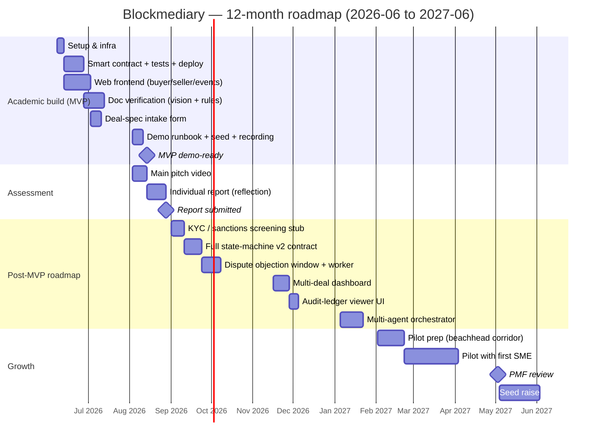

# Blockmediary — T-Shirt Sizing (effort breakdown)

**Team:** Transakt · **Product:** Blockmediary · **All times in days.**

Built using Tony Wood's *T-Shirt for PMF* template (BEEM063 facilitator deck, slides 56–60):
each task is broken into **Development + Testing + Deployment = Total Effort**, and the Total
maps to a T-shirt **Size**. Spreadsheet: [sizing.csv](sizing.csv).

## Size scale

| Size | Days | Description |
|------|------|-------------|
| XS | 3 | up to 3 days total effort |
| S | 7 | 4–7 days |
| M | 12 | 8–12 days |
| L | 20 | 13–20 days |
| XL | 30 | 21–30 days |
| XXL | 30+ | over 30 days |

## MVP scope (happy-path build)

| ID | Workstream | Task | Dev | Test | Deploy | Total | Size |
|----|------------|------|-----|------|--------|-------|------|
| 1 | Setup & Infra | Set up monorepo and developer environment (env / faucets / accounts) | 2 | 0 | 1 | 3 | XS |
| 2 | Setup & Infra | Configure deployment pipeline and secrets management | 2 | 1 | 1 | 4 | S |
| 3 | Smart Contract | Implement Escrow smart contract (state machine + role gating) | 6 | 3 | 1 | 10 | M |
| 4 | Smart Contract | Implement MockUSDC and ERC20 integration | 2 | 1 | 0 | 3 | XS |
| 5 | Smart Contract | Write contract test suite (happy path / access / refund) | 4 | 2 | 0 | 6 | S |
| 6 | Smart Contract | Deploy and verify contract on Base Sepolia (Ignition) | 2 | 1 | 2 | 5 | S |
| 7 | Frontend | Scaffold Next.js app and wallet connect (wagmi / RainbowKit) | 4 | 1 | 1 | 6 | S |
| 8 | Frontend | Build buyer panel (approve / deposit / balance) | 5 | 2 | 1 | 8 | M |
| 9 | Frontend | Build seller panel (upload / verdict / release) | 5 | 2 | 1 | 8 | M |
| 10 | Frontend | Implement on-chain event watching and state sync | 3 | 2 | 1 | 6 | S |
| 11 | Doc Verification | Build document upload API endpoint | 3 | 1 | 1 | 5 | S |
| 12 | Doc Verification | Integrate Claude vision extraction with Zod schema | 5 | 3 | 1 | 9 | M |
| 13 | Doc Verification | Implement deterministic rules engine | 4 | 3 | 1 | 8 | M |
| 14 | Doc Verification | Build authorised releaser bridge (recordVerdict on-chain) | 3 | 2 | 1 | 6 | S |
| 15 | Doc Verification | Implement audit-ledger logging | 2 | 1 | 1 | 4 | S |
| 16 | Deal Intake | Build escrow-spec intake form (structured terms → JSON) | 5 | 2 | 1 | 8 | M |
| 17 | Demo & Deliverables | Write demo runbook and seed script | 2 | 1 | 1 | 4 | S |
| 18 | Demo & Deliverables | Record fallback demo video | 2 | 1 | 0 | 3 | XS |
| | | **MVP SUBTOTAL** | **61** | **29** | **16** | **106** | |

## Roadmap (deferred — pitch as post-MVP)

| ID | Workstream | Task | Dev | Test | Deploy | Total | Size |
|----|------------|------|-----|------|--------|-------|------|
| 19 | Compliance | Build KYC / sanctions screening stub | 6 | 3 | 1 | 10 | M |
| 20 | Dispute | Build dispute objection window and worker | 8 | 4 | 2 | 14 | L |
| 21 | Smart Contract | Extend to full state-machine coverage (v2 contract) | 7 | 4 | 2 | 13 | L |
| 22 | Frontend | Build buyer/seller multi-deal dashboard | 8 | 3 | 1 | 12 | M |
| 23 | Frontend | Build audit-ledger viewer UI | 4 | 2 | 1 | 7 | S |
| 24 | Orchestration | Build multi-agent orchestrator (Agent SDK) | 10 | 5 | 2 | 17 | L |
| | | **ROADMAP SUBTOTAL** | **43** | **21** | **9** | **73** | |
| | | **GRAND TOTAL** | **104** | **50** | **25** | **179** | |

## Capacity check

Per the planning rule (flag if total effort > available days × team size × 0.7):

- **Build window:** 2026-06-08 → 2026-08-14 ≈ 10 weeks.
- **Assumption:** 5 members, part-time student capacity ≈ 2.5 effective days/week each → ~25 days/person → **~125 team-days**, of which 70% usable = **~88 team-days**.
- 🚩 **MVP at 106 team-days exceeds the ~88-day usable budget.** This is *why* `plans/mvp-slice.md`
  deliberately cuts to the happy path (single deal, invoice-only check, no dispute/KYC UI). The
  Roadmap block (73 days) is explicitly out of the build window and presented as future work.

> **Adjust the assumptions to your team's real availability.** Two levers bring MVP inside budget:
> (a) raise effective days/week, or (b) further trim MVP scope (e.g. defer task 16 deal-intake form
> to a hardcoded demo spec, saving 8 days).

## 12-month roadmap (Gantt)

Projection from the build kickoff (2026-06-08) through a year. The **Academic build** block
matches the MVP scope above; **Post-MVP roadmap** sequences the deferred tasks; **Growth**
projects the path to a beachhead pilot and seed raise. Diagram renders in VS Code's Markdown
preview and on GitHub.

> Durations are **calendar spans** (parallelised across the 5-person team), not the team-day
> efforts from the tables above — e.g. the 10-day KYC stub runs as one ~2-week calendar block.
> Adjust dates to your team's real availability and to any showcase events (e.g. FinTech West,
> tentatively 2026-09-18).
